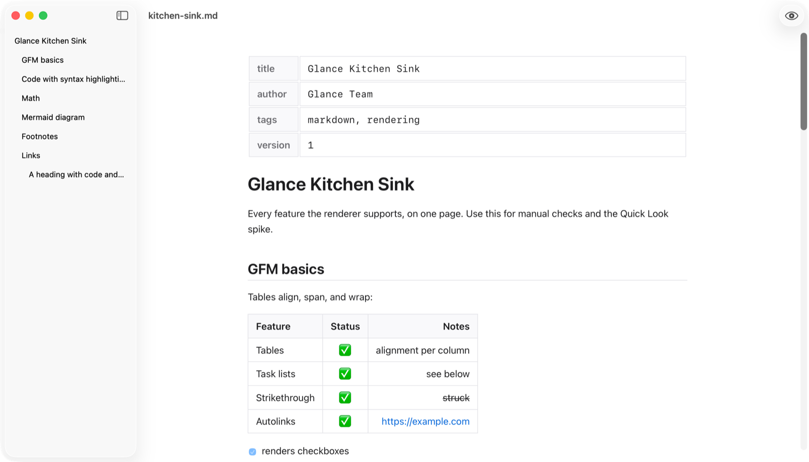
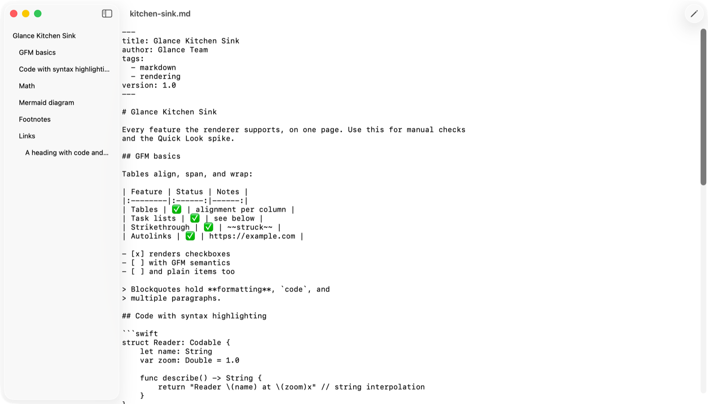
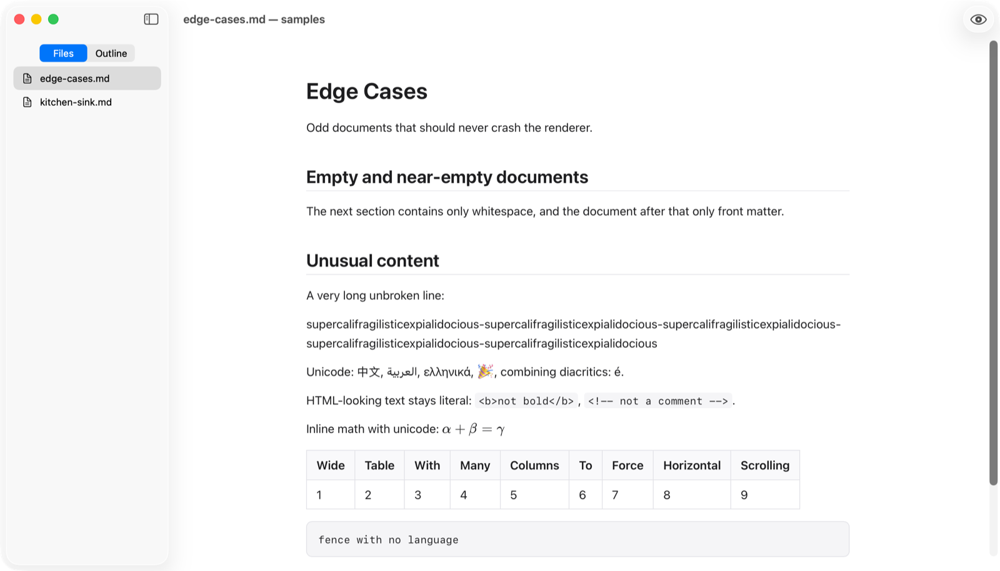

# Glance

<p align="center">
  
</p>

**Glance** is a free, open-source markdown reader for macOS. It renders markdown
read-only by default; an eye ⇄ pencil toolbar toggle (`⌘L`) switches to raw
source editing that saves back to the file. A built-in Quick Look extension
makes **spacebar-in-Finder** show the same rendering as the app.

- 🪶 Minimal and keyboard-first
- 🌗 Light and dark follow the system
- 🔌 Zero network access — strict offline CSP, all JS vendored and committed

|  |  |
|:---:|:---:|
| **Reading** — rendered view with the heading outline | **Editing** — raw source, `⌘S` saves in place |

|  |
|:---:|
| **Folders** — top-level `.md` files in the sidebar, `⌘1` / `⌘2` switch segments |

## Features

- GFM rendering: tables, task lists, strikethrough, autolinks
- Syntax-highlighted fenced code blocks
- YAML front matter rendered as a compact key/value table (keys in document order)
- Footnotes, math (`$…$` / `$$…$$` via KaTeX), Mermaid diagrams
- Eye ⇄ pencil editing with save, revert, and changed-on-disk conflict prompts
- Open a file **or a folder** (`⌘O`); folder files in the sidebar **Files**
  segment, document headings in **Outline**
- Finder spacebar preview via a Quick Look preview extension with identical styling

### Keyboard

| Key | Condition | Action |
|---|---|---|
| `⌘O` | always | Open file or folder |
| `⌘L` | writable file | Toggle read / edit mode |
| `⌘S` | editing | Save |
| `↑/↓` | reading | Scroll the document |
| `⌘1` / `⌘2` | folder open | Sidebar segment: Files / Outline |
| `⌘+` / `⌘−` / `⌘0` | reading | Zoom rendered text |
| `⌘W` | always | Close window |

## Install

Download **`Glance-<version>.dmg`** from [Releases](../../releases) and open it:

1. Drag **Glance** into **Applications**.
2. First launch: the build is ad-hoc signed and not notarized, so Gatekeeper
   warns — recent macOS may even say the app is damaged. It is not. Either
   run this once:

   ```sh
   xattr -cr /Applications/Glance.app
   ```

   …or right-click the app → **Open** → **Open** (or System Settings →
   Privacy & Security → **Open Anyway**).

The Finder Quick Look preview additionally requires a Developer ID–signed,
notarized build — see [Quick Look extension](#quick-look-extension).

Or build from source (Xcode 15+, macOS 13+, Node 18+ for the JS tests):

```sh
git clone <this repo> && cd glance
xcodebuild -project Glance.xcodeproj -scheme Glance -configuration Debug build
```

After editing `project.yml`, regenerate the project with `xcodegen generate`
(the generated `Glance.xcodeproj` is committed too, so this is optional).

## Contributing

Issues and pull requests are welcome! For larger changes, please open an
issue first to discuss what you'd like to change.

```
Glance.xcodeproj          generated from project.yml (xcodegen)
App/                      Glance.app target (SwiftUI, MVVM)
QuickLookExtension/       GlanceQuickLook.appex (sandboxed, MarkdownKit only)
MarkdownKit/              local SPM package: markdown text → styled HTML
  Sources/…/Resources/      template.html, theme.css, js/pipeline.js, js/vendor/
  JSTests/                  vitest suite for pipeline.js
GlanceTests/ GlanceUITests/  XCTest unit + UI smoke
samples/                  kitchen-sink.md, edge-cases.md
tools/vendor-js.sh        pinned JS vendoring (updates js/vendor/)
tools/WebSmoke/           dev harness: renders a sample in a real WKWebView
```

Useful before opening a PR:

```sh
# pipeline tests (vitest — the primary rendering regression guard)
cd MarkdownKit/JSTests && npm install && npm test

# Swift unit + UI tests
xcodebuild -project Glance.xcodeproj -scheme Glance -destination 'platform=macOS' test

# rendering smoke in a real WKWebView
swift run --package-path tools/WebSmoke WebSmoke hybrid samples/kitchen-sink.md
```

## Quick Look extension

The appex renders with the identical MarkdownKit pipeline, so Finder's
spacebar preview matches the app window. To check it locally:

```sh
APP=$(ls -d ~/Library/Developer/Xcode/DerivedData/Glance-*/Build/Products/Debug/Glance.app | head -1)
pluginkit -a "$APP/Contents/PlugIns/GlanceQuickLook.appex"   # register
qlmanage -p samples/kitchen-sink.md                          # preview
```

If the preview spins forever or falls back to plain text, see
[Quick Look troubleshooting](#quick-look-troubleshooting-macos-26-findings).
(Known limitation, same as all QL markdown extensions: relative images may
not resolve inside Finder previews.)

### Quick Look troubleshooting (macOS 26 findings)

If Finder's spacebar preview spins forever or falls back to plain text, the
extension metadata must match all of the following (verified against a known
working extension, sbarex/QLMarkdown):

- `NSExtensionPrincipalClass` (not `NSExtensionMainClass`) in the appex
  Info.plist — current QL hosts resolve only this key.
- `QLIsDataBasedPreview: true` in `NSExtensionAttributes` — required for
  data-based previews (we return HTML data, not a file URL).
- `ENABLE_DEBUG_DYLIB: NO` on the appex target — Xcode 16+ splits Debug
  builds into a stub executable + debug dylib, which breaks the extension
  handshake.
- No `get-task-allow` in the *signed* entitlements (`CODE_SIGN_INJECT_BASE_ENTITLEMENTS: NO`);
  the appex must carry only `com.apple.security.app-sandbox`.
- Install the app to `/Applications`, register with
  `pluginkit -a …/GlanceQuickLook.appex`, and restart the daemon with
  `killall quicklookd`.

**Signing gate:** on macOS 26 the daemon launches an ad-hoc–signed appex but
never completes hosting it — `providePreview` is never called and Finder
falls back to the generic text preview. A Developer ID–signed, notarized
build is required for the Finder preview to render. Everything up to that
gate is verified: registration, user approval toggle (Login Items &
Extensions), binary loading, and class resolution all pass, and the exact
reply HTML is proven renderable by `tools/WebSmoke` in inline mode.

## Architecture notes

- **MarkdownKit is webview-free**: its whole public surface is "markdown text
  → styled HTML document". `pipeline.js` is an ES module with no imports —
  libraries come from `globalThis` (vendored classic `<script>` tags in the
  app, node_modules under vitest) so the identical file runs in both.
- **Asset delivery** (verified empirically with `tools/WebSmoke`): under
  `WKWebView.loadHTMLString`, classic `file:` scripts load fine, but a module
  script with a `file:` URL never executes (opaque origin). Hence:
  - app → `.hybrid`: vendor scripts referenced from the bundle, pipeline.js
    inlined as an inline module
  - Quick Look → `.inline`: everything embedded, fonts as `data:` URLs
- **DocumentModel** owns all mutable state; the read/edit rules are a
  testable decision API (`leavingEditing()`, `requestLeavingEditing(then:)`,
  `resolveExit(_:)`) so prompt behavior is unit-tested without UI.
- Menu commands route to the focused window's model via `FocusedValue` +
  the responder chain; there are no global singletons.

### Known limitations

- On current macOS (26), SwiftUI does not reliably re-evaluate
  `@FocusedValue`-driven menu item enable states; the menu items stay
  enabled and no-op when inapplicable. The toolbar toggle does reflect state
  (disabled with a tooltip when the file is read-only on disk), as specified.
- Closing the window while dirty prompts Save / Revert / Cancel; quitting
  the whole app while dirty does not prompt yet.
- Relative images don't render in Finder previews (Quick Look host
  limitation).
- The Finder Quick Look preview needs a notarized build (see above).

## License

[MIT](LICENSE) — free to use, modify, and share.

## Acknowledgements

Glance stands on the shoulders of excellent open-source software, vendored
with pinned versions in
[`MarkdownKit/Sources/MarkdownKit/Resources/js/vendor`](MarkdownKit/Sources/MarkdownKit/Resources/js/vendor/LICENSES.md):
[markdown-it](https://github.com/markdown-it/markdown-it) and its plugin
ecosystem, [KaTeX](https://github.com/KaTeX/KaTeX),
[highlight.js](https://github.com/highlightjs/highlight.js),
[mermaid](https://github.com/mermaid-js/mermaid), and
[js-yaml](https://github.com/nodeca/js-yaml).
