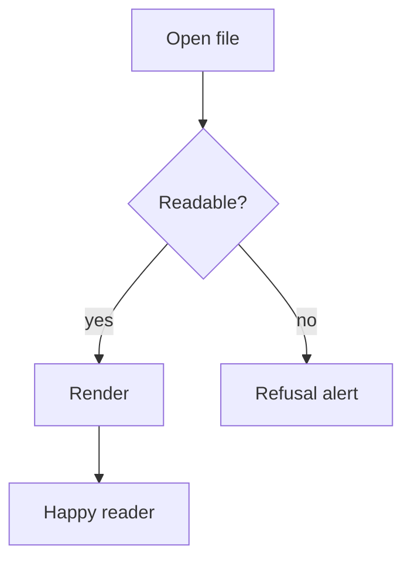

# Glance Kitchen Sink

Every feature the renderer supports, on one page. Use this for manual checks
and the Quick Look spike.

## GFM basics

Tables align, span, and wrap:

| Feature | Status | Notes |
|:--------|:------:|------:|
| Tables | ✅ | alignment per column |
| Task lists | ✅ | see below |
| Strikethrough | ✅ | ~~struck~~ |
| Autolinks | ✅ | https://example.com |

- [x] renders checkboxes
- [ ] with GFM semantics
- [ ] and plain items too

> Blockquotes hold **formatting**, `code`, and
> multiple paragraphs.

## Code with syntax highlighting

```swift
struct Reader: Codable {
    let name: String
    var zoom: Double = 1.0

    func describe() -> String {
        return "Reader \(name) at \(zoom)x" // string interpolation
    }
}
```

```python
def greet(name: str) -> str:
    return f"Hello, {name}!"
```

An unknown language stays escaped but styled:

```weirdlang
a < b and c > d
```

## Math

Inline math like $E = mc^2$ sits in a sentence, and display math is centered:

$$
\int_0^1 x^2 \, dx = \frac{1}{3}
$$

Bad math degrades to inline error text: $\notacommand{x}$.

## Mermaid diagram



An invalid diagram shows an error box inside its container:

```mermaid
graph TD
    A --> ]broken[
```

## Footnotes

Glance supports footnotes[^1] and named ones[^note].

[^1]: A standard footnote.
[^note]: A named footnote with `code` inside.

## Links

- Relative link to another document: [edge cases](edge-cases.md)
- Anchor link: [back to top](#glance-kitchen-sink)
- External link: [example.com](https://example.com)
- Image (missing on purpose — placeholder expected): 

### A heading with `code` and **bold**

Duplicates get unique anchors: another "Code with syntax highlighting" section
name appears once above; the outline must still be in document order.
